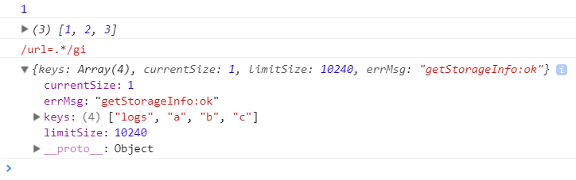

## wxapp-store

 


`wxapp-store` 是一个微信小程序本地数据持久化存储库。

**特性：**
- 简洁的 api。
- 支持 async/await，promise 语法。
- 支持基础数据类型存储：object、array、string、number、boolean
- 支持正则表达式类型存储。
- 与原生接口保持一致的性能。

### install

```js
yarn add wxapp-store
```

### api
> new Store({ async: true, wx: wx });

- get(key)
- set(key, value)
- info()
- remove(key)
- clear()

### 使用
默认 Store 为异步存储，通过指定配置项 async 来设置。异步存储与同步存储 api 一样，使用异步存储时返回的是 Promise。**注意：**需要关闭 ES6 转 ES5。

```js
const Store = require('wxapp-store');   // 具体路径指定定位
const store = new Store({ wx });        // 必须指定 wx 对象
+ async function() {
    await store.set('a', 1);
    console.log(await store.get('a'));  // 1

    await store.set('b', [1, 2, 3]);
    console.log(await store.get('b'));  // [1, 2, 3]

    await store.set('c', /url=.*/gi);
    console.log(await store.get('c'));  // /url=.*/gi

    console.log(await store.info());

    await store.remove('c');
    await store.clear();
} ();
```



在 Wepy 里使用的时候，可以指定 wx 对象。

```js
const store = new Store({ wx: wepy });
```

